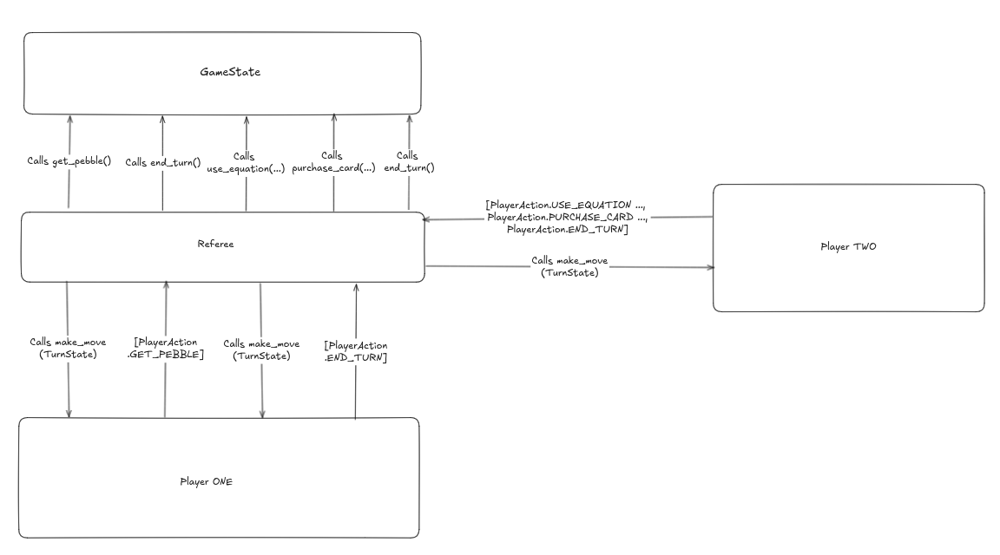

**TO:** Matthias Felleisen, Ben Lerner

**FROM:** Rishi Kanabar, John Rotondo

**DATE:** October 10, 2024

**SUBJECT:** Player Protocol Design for the Bazaar Game

With the planned `Referee` implementation, the role of the `Referee` is to act as a proxy between all of the players and the `GameState`.

A move in the game of Bazaar is defined as a list of `PlayerAction`s. A `PlayerAction` will have a type associated with the actions. The type will be one of `GET_PEBBLE`, `USE_EQUATION`, `PURCHASE_CARD`, and `END_TURN`. The `PlayerAction` will also have validated options associated with it: the `index` which is an integer and `right_to_left` boolean field. `index` must be provided if the type is `PURCHASE_CARD`. _Both_ `index` and `right_to_left` must be provided if the type is `USE_EQUATION`.

All of the players in the game of Bazaar must be encapsulated in a class with a public method called `make_move`. This method would return a list of `PlayerAction`s given the `TurnState` for that player. The role of the Referee is to sequentially apply the `PlayerAction`s returned by the player till a `PlayerAction` of type `END_TURN` is passed. Once the player requests to end the turn, the referee calls `end_turn` on the internal `GameState`, moving the turn context to the next active player.

Currently, `PlayerAction` is defined in the `Bazaar.Player.player_action` module.

```python
class Player(ABC):
    @abstractmethod
    def make_move(self, turn_state: TurnState) -> list[PlayerAction]:
        ...
```

The `list[PlayerAction]` return value may not be a full list of _all_ moves that player wants to make. It can be a sub-list of the intended moves within that turn. If the player tries to play an invalid move then the method in `GameState` associated with that action throws a `BazaarException`. The `Referee` catches this exception and kicks the player for making in invalid move.



As per the data flow diagram above (read counter clockwise starting from the leftmost arrow for Player ONE), the `GameState`, that resides inside the `Referee` is the single source of truth for all game-specific data, including tracking of the current player. The Referee calls appropriate methods on the GameState based on the actions that the player wants to make.
