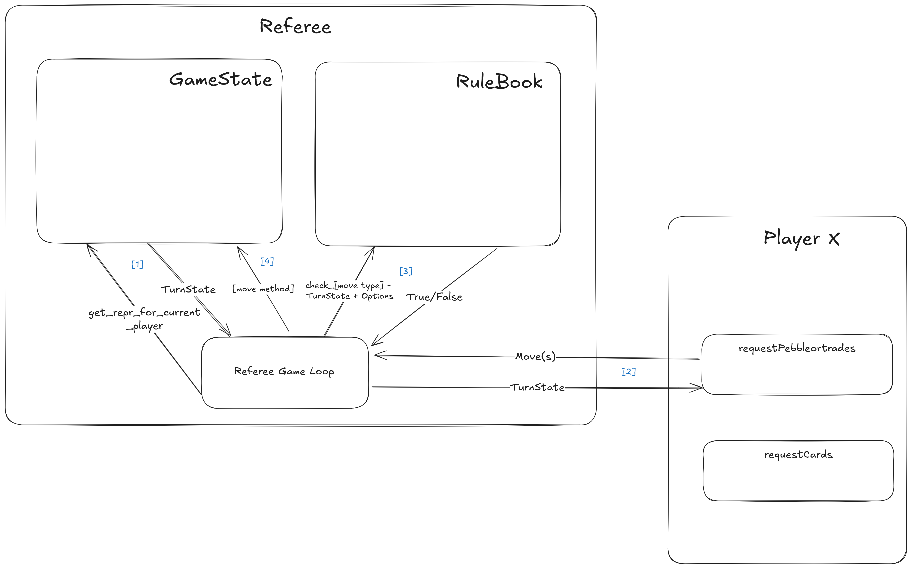

**TO:** Matthias Felleisen, Ben Lerner

**FROM:** Rishi Kanabar, John Rotondo

**DATE:** October 17, 2024

**SUBJECT:** Player Protocol Design for the Bazaar Game

With our initial plan of the `GameState`, the responsibility of the `GameState` was doing both: checking the validity of moves _and_ modifying itself to reflect the new state of the game. Moreover, the purpose of the referee was to act as a proxy between the players and the `GameState`. What this implied was that the rules of the game were very tightly coupled with the implementation of the GameState and modifying the rules implied modifying the `GameState` class.

With the new and improved design, the `GameState` is almost entirely decoupled from the `RuleBook` implementation. The ideal `Referee` implementation _now_ would be to check the validity of the moves using the `RuleBook` class _and_ call the relevant methods on the `GameState` based on what the player wishes to do.

Currently, the `GameState` class has the following public methods:

```python
class GameState:
    def get_pebble(self) -> None:
        ...

    def use_equation(self, equation_index: int, left_to_right: bool) -> None:
        ...

    def purchase_card(self, card_index: int):
        ...

    def end_turn(self) -> None:
        ...

    def kick_player(self, player_index: int) -> None:
        ...
```

All of these public methods, _except_ `kick_player` perform the said action on the _current_ player which is maintained as an index (`current_player_index`).

The planned `Referee` implementation will have a `RuleBook` instance that is passed in the constructor. The `Referee` will also take in a list of `GamePlayer`. The `Referee` can also have an additional feature to take in a existing `GameState` in the constructor to resume a game. If no `GameState` is passed in, the `Referee` will initialize the `GameState` based on the constant properties defined in the `RuleBook`. After te `GameState` is initialized, the `Referee` will call `get_repr_for_current_player` on the `GameState` to get the current player information. The `Referee` will then call the relevant methods detailed in **Player API** to get the current player's moves. Given that the `Referee` successfully receives the relevant moves from the `GamePlayer`, they will call the appropriate method on the `RuleBook` to validate the move. If the method returns `True`, the move is valid -- the `Referee` then calls the appropriate method on the `GameState` to execute that move. If the `RuleBook`'s method returns `False`, the `Referee` calls `kick_player` with the appropriate player index. Once the player is done playing their move, the `Referee` calls `end_turn` to switch to the next player, repeating this process of prompting for a move from the current player, validating it using the `RuleBook` static methods and executing the moves through the `GameState`.

```python
class RuleBook:
    @staticmethod
    def check_get_pebble_or_exchange(turn_state: TurnState, actions: list[PlayerAction]) -> bool:
        ...
    @staticmethod
    def check_purchase_cards(turn_state: TurnState, actions: list[PlayerAction]) -> bool:
        ...

```

Refer to the information flow diagram below. Read the arrows in the numerical orders.



With the above interaction diagram, the role of the `Referee` is to prompt a move from the `GamePlayer`, call the appropriate method on the `RuleBook` to validate the move and then finally execute the move by calling the appropriate method on the `GameState`. The `Referee` will also be responsible for converting the list of actions given by the player to a list of `PlayerAction`s that is recognized by `RuleBook`.
